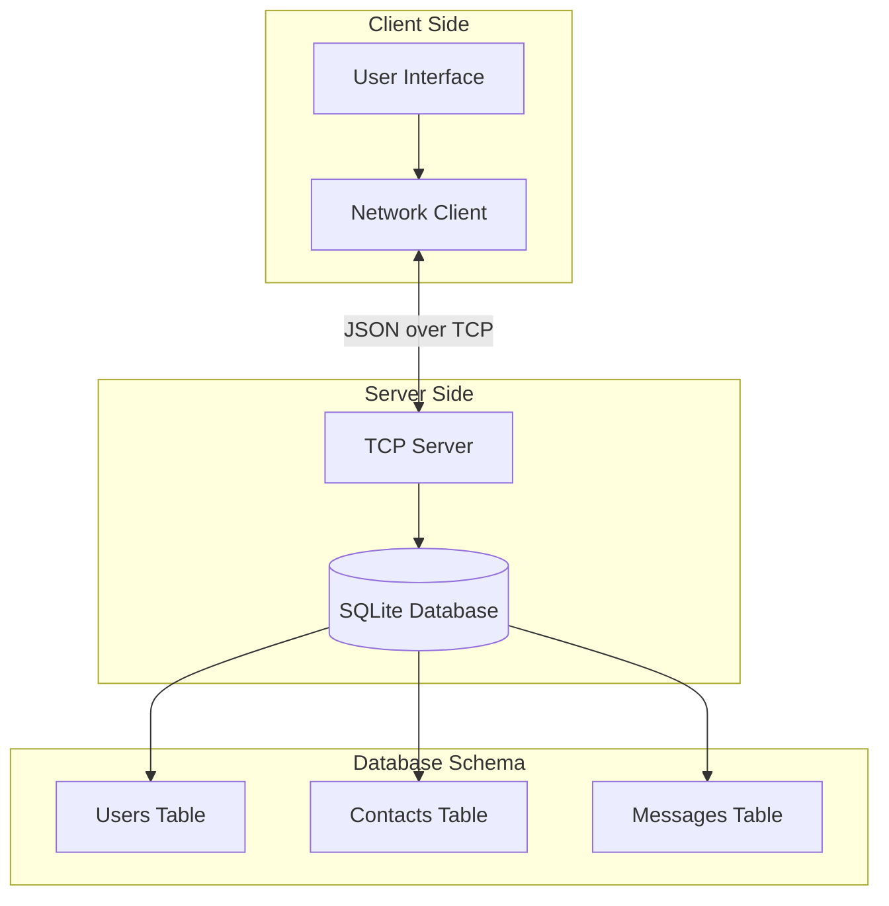

# 💬 Qt Messenger

<div align="center">


**A modern, real-time messaging application built with Qt/C++ featuring a robust client-server architecture**

[Features](#-features) • [Installation](#-installation) • [Usage](#-usage) • [Architecture](#-architecture) • [Contributing](#-contributing)

</div>

---

## 🚀 Features

### 🔐 **Authentication & Security**
- **Secure user registration** with email validation
- **Password hashing** using industry-standard algorithms
- **Session management** with automatic reconnection
- **Input validation** and sanitization

### 💬 **Real-time Messaging**
- **Instant message delivery** via TCP sockets
- **Message history persistence** with SQLite database
- **Read receipts** and message status tracking
- **Support for text and file sharing**

### 👥 **Contact Management**
- **Add contacts** by username
- **Contact search** with real-time filtering
- **Bidirectional contact relationships**
- **Online status indicators**

### 🎨 **Modern User Interface**
- **WhatsApp-inspired design** with professional aesthetics
- **Light and dark theme support** with smooth transitions
- **Responsive layout** that adapts to different screen sizes
- **Custom chat bubbles** with timestamp formatting
- **Intuitive navigation** and user experience

### ⚡ **Performance & Reliability**
- **Asynchronous networking** for responsive UI
- **Automatic reconnection** handling network interruptions
- **Efficient database operations** with proper indexing
- **Memory management** following Qt best practices

---

## 📋 Prerequisites

Before building Qt Messenger, ensure you have the following installed:

| Component | Version | Purpose |
|-----------|---------|---------|
| **Qt Framework** | 5.15+ or 6.x | GUI framework and networking |
| **C++ Compiler** | C++17 compatible | GCC 7+, Clang 5+, or MSVC 2017+ |
| **CMake** | 3.14+ | Build system |
| **SQLite** | 3.x | Database (included with Qt) |

### Platform-Specific Requirements

<details>
<summary><strong>🪟 Windows</strong></summary>

- Visual Studio 2017+ or MinGW
- Qt 6.x with MinGW or MSVC kit
- CMake (can be installed via Qt installer)

</details>

<details>
<summary><strong>🐧 Linux</strong></summary>

```bash
# Ubuntu/Debian
sudo apt update
sudo apt install qt6-base-dev qt6-tools-dev cmake build-essential

# Fedora/RHEL
sudo dnf install qt6-qtbase-devel qt6-qttools-devel cmake gcc-c++

# Arch Linux
sudo pacman -S qt6-base qt6-tools cmake gcc
```

</details>

<details>
<summary><strong>🍎 macOS</strong></summary>

```bash
# Using Homebrew
brew install qt cmake

# Or download Qt from official website
# https://www.qt.io/download
```

</details>

---

## 🛠️ Installation

### 1. Clone the Repository

```bash
git clone https://github.com/yourusername/qt-messenger.git
cd qt-messenger
```

### 2. Build the Project

#### Option A: Using CMake (Recommended)

```bash
# Create build directory
mkdir build && cd build

# Configure the project
cmake .. -DCMAKE_BUILD_TYPE=Release

# Build the project
cmake --build . --config Release

# Optional: Install (Linux/macOS)
sudo cmake --install .
```

#### Option B: Using Qt Creator

1. Open `CMakeLists.txt` in Qt Creator
2. Configure the project with your preferred kit
3. Build the project (Ctrl+B)

#### Option C: Using qmake

```bash
# Build server
cd server
qmake server.pro
make

# Build client
cd ../client
qmake client.pro
make
```

---

## 🎯 Usage

### Starting the Server

```bash
# Navigate to build directory
cd build

# Start the server (default port: 8080)
./server/QtMessengerServer

# Or specify a custom port
./server/QtMessengerServer --port 9090
```

**Server Console Output:**
```
Server is running on port 8080
Database initialized successfully
Waiting for client connections...
```

### Launching the Client

```bash
# In a new terminal, start the client
./client/QtMessengerClient
```

### First-Time Setup

1. **Register a new account:**
   - Click "Register" on the login screen
   - Fill in username, email, and password (min. 8 characters)
   - Click "Create Account"

2. **Login:**
   - Enter your credentials
   - Check "Remember Me" for convenience
   - Click "Login"

3. **Add contacts:**
   - Click the "+" button in the contacts panel
   - Enter a username to add as contact
   - Start messaging!

---

## 🏗️ Architecture

### System Overview



### Project Structure

```
qt-messenger/
├── 📁 client/                 # Client application
│   ├── 📄 main.cpp           # Application entry point
│   ├── 📄 loginwindow.*      # Login interface
│   ├── 📄 registerwindow.*   # Registration interface
│   ├── 📄 mainwindow.*       # Main chat interface
│   ├── 📄 networkclient.*    # Network communication
│   ├── 📄 chatbubble.*       # Message bubble widget
│   ├── 📄 contactlistitem.*  # Contact list item widget
│   ├── 📄 utils.*            # Utility functions
│   └── 📁 resources/         # UI resources and themes
├── 📁 server/                # Server application
│   ├── 📄 main.cpp           # Server entry point
│   ├── 📄 server.*           # TCP server implementation
│   ├── 📄 database.*         # Database operations
│   ├── 📄 user.*             # User data model
│   └── 📄 message.*          # Message data model
├── 📄 CMakeLists.txt         # Main CMake configuration
├── 📄 README.md              # This file
└── 📄 presentation_script.md # Presentation guide
```

### Key Components

#### 🖥️ **Client Architecture**
- **Qt Widgets** for cross-platform GUI
- **QTcpSocket** for server communication
- **JSON protocol** for data exchange
- **Custom widgets** for modern UI components
- **Theme system** with QSS stylesheets

#### 🖧 **Server Architecture**
- **QTcpServer** for handling multiple clients
- **SQLite database** for data persistence
- **JSON message routing** between clients
- **User session management**
- **Asynchronous request processing**

#### 🗄️ **Database Schema**

| Table | Purpose | Key Fields |
|-------|---------|------------|
| `users` | User accounts | id, username, email, password_hash |
| `contacts` | Friend relationships | user_id, contact_id |
| `messages` | Chat history | sender_id, receiver_id, content, timestamp |

---

## 🔧 Configuration

### Server Configuration

The server can be configured via command-line arguments:

```bash
./QtMessengerServer --help
```

**Available options:**
- `--port, -p`: Server port (default: 8080)
- `--help, -h`: Show help information
- `--version, -v`: Show version information

### Client Configuration

Client settings are automatically saved using Qt's QSettings:

**Windows:** `HKEY_CURRENT_USER\Software\QtMessenger`
**macOS:** `~/Library/Preferences/com.QtMessenger.plist`
**Linux:** `~/.config/QtMessenger.conf`

---

## 🧪 Testing

### Manual Testing

1. **Start the server**
2. **Launch multiple client instances**
3. **Register different users**
4. **Test messaging between users**
5. **Verify message persistence**

### Automated Testing (Future Enhancement)

```bash
# Unit tests (planned)
cd build
ctest

# Integration tests (planned)
./tests/integration_tests
```

---

## 🤝 Contributing

We welcome contributions! Please follow these guidelines:

### Development Setup

1. Fork the repository
2. Create a feature branch: `git checkout -b feature/amazing-feature`
3. Follow the coding standards (see below)
4. Commit your changes: `git commit -m 'Add amazing feature'`
5. Push to the branch: `git push origin feature/amazing-feature`
6. Open a Pull Request

### Coding Standards

- **C++ Style:** Follow Qt coding conventions
- **Naming:** Use camelCase for variables, PascalCase for classes
- **Documentation:** Document public APIs with Doxygen comments
- **Testing:** Add tests for new features


## 📄 License

This project is licensed under the MIT License - see the [LICENSE](LICENSE) file for details.

```
MIT License

Copyright (c) 2025 Qt Messenger Team

Permission is hereby granted, free of charge, to any person obtaining a copy
of this software and associated documentation files (the "Software"), to deal
in the Software without restriction, including without limitation the rights
to use, copy, modify, merge, publish, distribute, sublicense, and/or sell
copies of the Software, and to permit persons to whom the Software is
furnished to do so, subject to the following conditions:

The above copyright notice and this permission notice shall be included in all
copies or substantial portions of the Software.

THE SOFTWARE IS PROVIDED "AS IS", WITHOUT WARRANTY OF ANY KIND, EXPRESS OR
IMPLIED, INCLUDING BUT NOT LIMITED TO THE WARRANTIES OF MERCHANTABILITY,
FITNESS FOR A PARTICULAR PURPOSE AND NONINFRINGEMENT. IN NO EVENT SHALL THE
AUTHORS OR COPYRIGHT HOLDERS BE LIABLE FOR ANY CLAIM, DAMAGES OR OTHER
LIABILITY, WHETHER IN AN ACTION OF CONTRACT, TORT OR OTHERWISE, ARISING FROM,
OUT OF OR IN CONNECTION WITH THE SOFTWARE OR THE USE OR OTHER DEALINGS IN THE
SOFTWARE.
```

---

## 🙏 Acknowledgments

- **Qt Framework** - For providing an excellent cross-platform development framework
- **SQLite** - For the reliable embedded database engine
- **Modern UI Design** - Inspired by contemporary messaging applications

---

<div align="center">

**⭐ If you found this project helpful, please give it a star! ⭐**

Made with ❤️ using Qt and C++

</div>